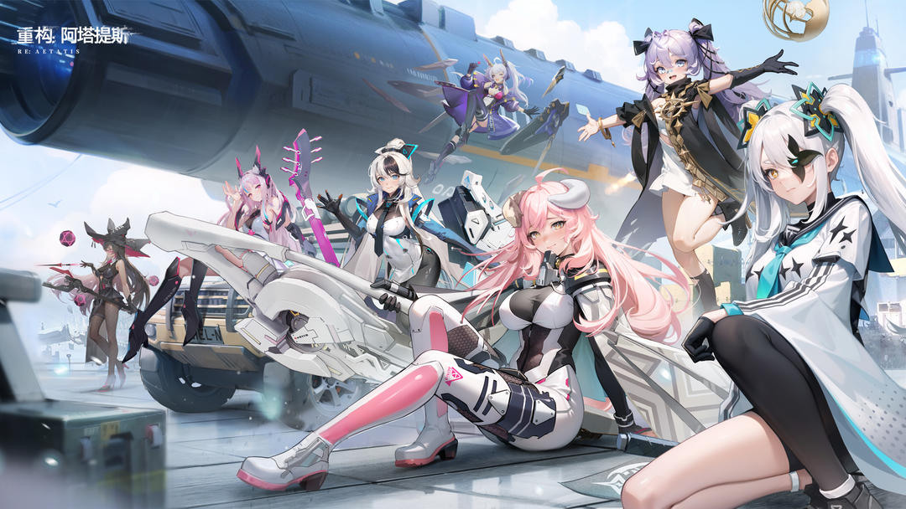
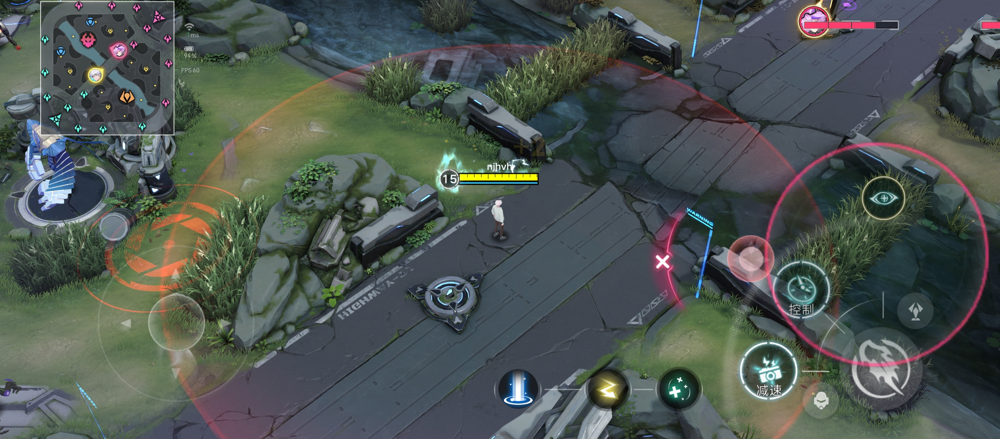
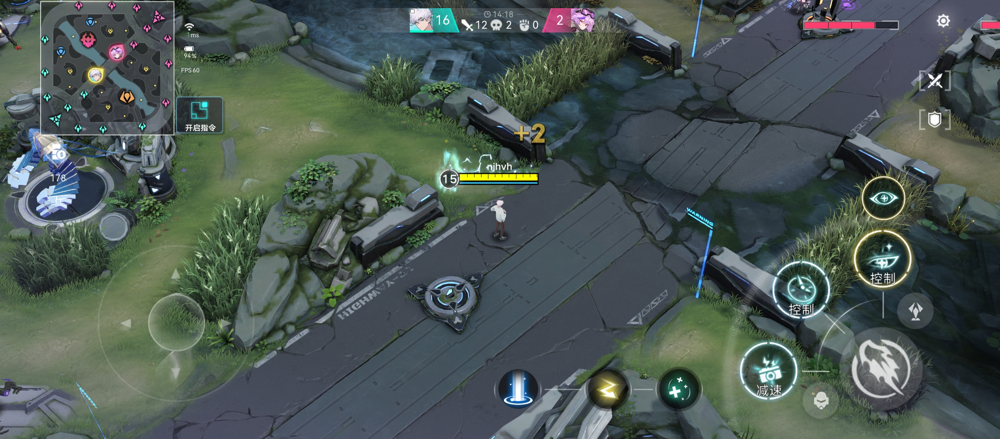
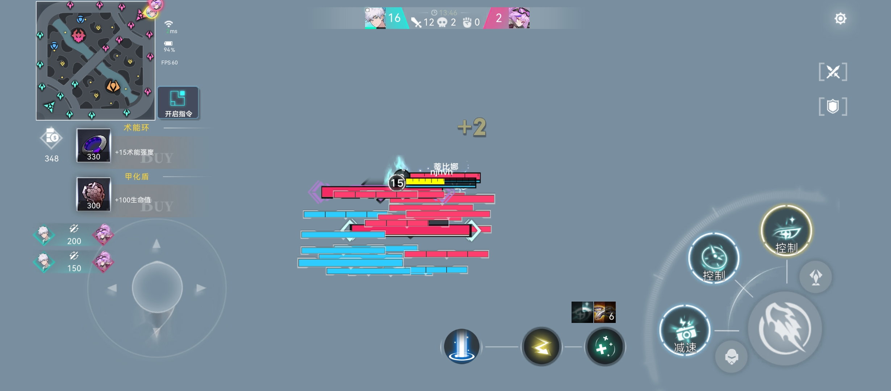
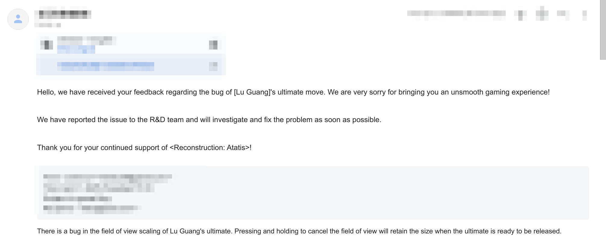
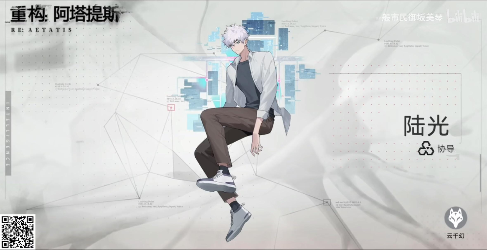

Last month when I was playing Re: Atatis(a MOBA game), I found a bug in the game.

When using ultimate of the character "Lu Guang", the normal operation of it is:
1. Touch the ultimate button, the view will be changed to the top view.
2. When release the button, the character will move to a new position, and the view will be changed back to normal.
3. If cancelled, ultimate won't be released and view will be changed back to normal.

But! When I was playing, I want to cancel ultimate like this:

The view won't change even after cancel it:

And if I repeat the operation, the view will become as higher as you can:

This bug is so funny! I can see the whole map from the top view. But well, it has been fixed in the latest version.

(btw this character is so powerful, could you please nerf it?)

