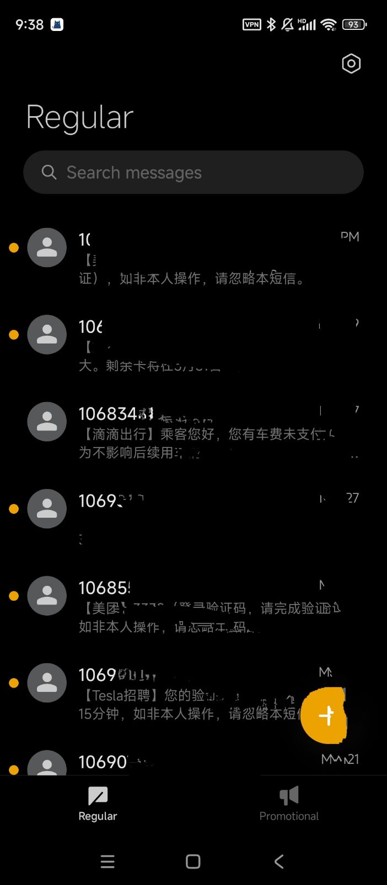
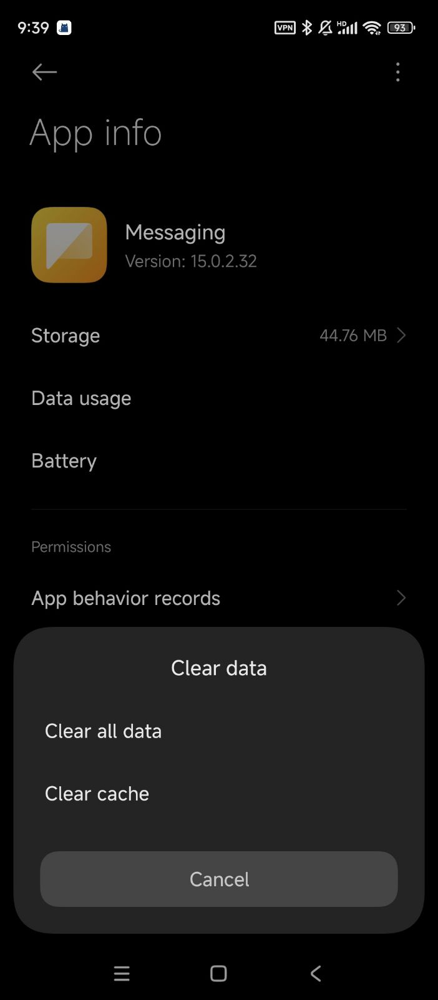

There are so much spam in our life, from ISP, from app, from...everywhere

I came up a method to deal with these, but aggressive way.

> This only test with Redmi Phone in China
> may not work in other phone or other country

First, download the app Google Messages, then set it as default message app.

Then, clear the data of the default messaging app that phone come with

Ok, well done! Since Google Service is banned in China, I won't receive any messages from ISP or something like that!